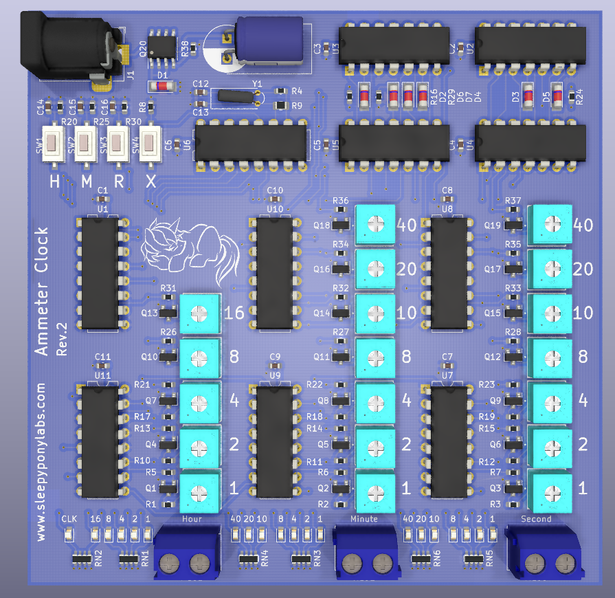

# Ammeter Clock Controller

This is an open-source KiCAD 5 design files for a logic chips-driven clock that output time on three ammeters.

## Pictures

## Features

This is a unique clock that will certainly impress people around you.

- Ammeter Output
	- Shows hour, minute, and second on three ammeters.
	- Works with both analog and digital meters.
- Quartz Crystal-driven Clock with CD4060 IC
- Design with logic ICs. Only need 11 chips for the circuit to work.
- Set Hour, Set Min, Reset, and Clock Halt buttons
- Ammeter adjustment trimpots
- Aluminum Front Panel design available [here](https://github.com/Sirawit7205/ammeter-clock-frontpanel)

## Revisions

We are currently at Revision 2. Changelog is below:

**Revision 1 (July 2021)**
- Initial Design
- H and M buttons are swapped.

**Revision 2 (September 2021)**
- Fix H and M buttons.

## What is provided

The goal of this repository is to enable you to build this on your own as easy as possible. **The schematics, PCB design, and an interactive BOM are provided.**

Hardware is licensed under `SPDX-License-Identifier: CERN-OHL-S-2.0`

Contains no software

Documentation is licensed under `SPDX-License-Identifier: CC-BY-SA-4.0`

## Ordering

You can export gerbers from this project and order the board yourself.
